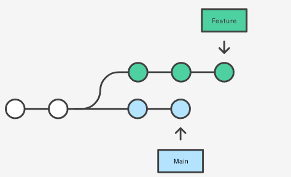
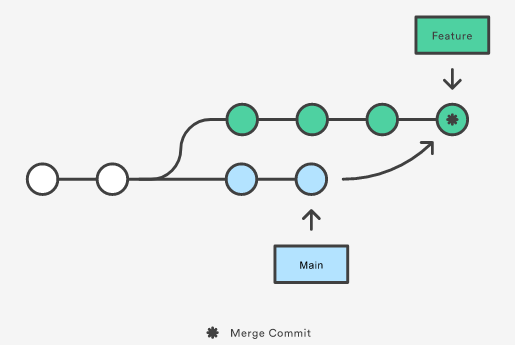
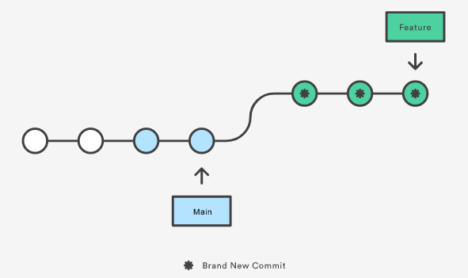

## Git History Commands
These commands will tamper with the history, rewriting it to make it easier to trace what was done, and divide the commits into the implementation of the features separately rather than everything at the same time. 

More here : [Atlassian: Rewriting History](https://www.atlassian.com/git/tutorials/rewriting-history)

---
### Git Commit --amend
Note that the modified commits are actually new commits.
<br>Be very careful not to --amend a commit on which someone else is developing. 

``git commit --amend -m "message"`` modifies the commit and replaces the message. 
<br>``git commit --amend --no-edit`` modifies the commit without changing the original message.

---
### Git Reset
Git reset moves the HEAD

``git reset HEAD``


---
### Git Rebase
Git Rebase is a means to update your feature branch with the main as the source, without creating a commit each time you have to update your feature branch! Let's see how it works.

Problem: we want to update our feature branch with the latest changes applied on the main.
<center>


</center>

```
// Solution #1: MERGE
git checkout feature
git merge main
```

<center>


</center>
As you can see, every update we will be doing will require an extra commit, which on big project.

---
```
// Solution #2: REBASE
git checkout feature
git rebase main
```
<center>


</center>
Here, the feature branch is replayed from the HEAD of the main. Each commit of the branch becomes a new commit with a different hash.

This has various benefits:
- the history of the branch is linear and easy to read
- there is no fork, you don't have to check when the updates from main occurred since everything is based on the main's latest commit 


**NEVER REBASE A PUBLIC BRANCH!**
<br>**NEVER REBASE A BRANCH SHARED WITH SOMEONE ELSE!**

Since it **rewrites** the history and discards previous commits to make new commits. It is a **destructive** operation!
### --squash and --autosquash

Because of this, you may have to force push:

``git push --force`` pushes your rewritten history, does not preserve new commits from other people in the remote

``git push --force-with-lease`` pushes your rewritten history only if there are new commits. This prevents from forcefully pushing and erasing the work from others. Use ``git fetch`` 


``git rebase --interactive --autosquash``

Video: [Git Rebase in 6 minutes](https://www.youtube.com/watch?v=f1wnYdLEpgI)

[Atlassian: Merge vs Rebase ](https://www.atlassian.com/git/tutorials/merging-vs-rebasing)

---
### Git Revert

``git revert <commit-hash>``