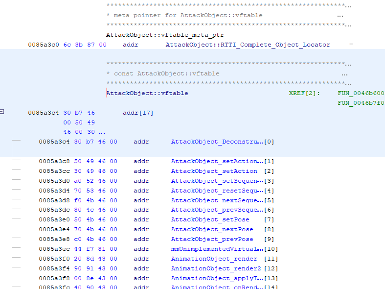

## vtables

A ``vtable`` (or ``vftable``, for virtual functions table) is how most C++ implementations do polymorphism.

```
class ParentClass
{
    public virtual void virtualFunction()
    {
        // Parent Implementation
    }

    public virtual void pureVirtualFunction() = 0;
}

class ChildClass : ParentClass
{
    public override void virtualFunction()
    {
        // Child Implementation, overriding's Parent Implementation
    } 
}
```

Each class derived from a base class have their own **table of function pointers containing all virtual methods they implemented** from the base class.

When one calls a virtual method, we look up the object's vtable and call the appropriate derived class method.
<br>*[What is a vtable in C++ (StackOverflow)](https://stackoverflow.com/a/3555290)*

|                 | ParentClass             | ChildClass          |
| --------------- | ----------------------- | ------------------- |
| addr_vtable+0x0 | \*destructor()          | \*destructor()      |
| addr_vtable+0x4 | \*virtualFunction()     | \*virtualFunction() |
| addr_vtable+0x8 | \*pureVirtualFunction() |                     |

The offset of the functions may vary, ParentClass' and ChildClass' virtualFunction() pointers are not necessarily both at ``addr_vtable+0x4``.
<br>*ParentClass vtable's pointers to destructor() and virtualFunction() are different from the ones in ChildClass' vtable.*


*<p align=center>Even if we call it a table, a vtable is a list of function pointers, hence why the addresses of each function is incremented by 0x4.</p>*

**The first pointer of a vtable ALWAYS points to the destructor!** (write in red)
<br>Here, at 0x85A3C4.

Why?

When a class is created, even if the destructor is not explicitly defined (therefore non-virtual and not part of the vtable), the compiler generates a default destructor. That is, all inheriting classes will inherit this destructor (non-virtual, not in vtable)!
<br>*Constructors are not in the vtable however, as they cannot be virtual.*

Note that even if the destructor is defined as non-virtual, it is quite unsafe because of unproper cleanups with the derived classes!

Here, most of the guesswork has already been done, but the functions here are natively named ``FUN_<ADDRESS>``.

When the decompiled code refers to a function in the vtable, it may appear as ``object + 0x<Offset>``.