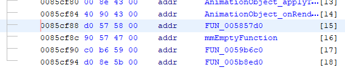

## Find the hierarchy of the program
To understand what does a part of the program , it is never a bad thing to understand what it does globally.

Indeed, a program will have key sections like:

- the entry point
- the main loop
- inputs handling
- the game logic
- rendering

## The entry point
``.exe`` files have a common entry point named ``entry``.

``.DLL`` files will most likely have an ``init`` entry point.

## Searching more locally
Getting the entry point is all good, but not necessarily what you need especially if you are looking for the logic of class methods.

Click on a function and hit ``Shift+F`` and explore which functions call the one you selected. If there is only one result, you're most probably on a good track, else you will have to dig around.

Here, it is called by a pointer of a vtable.

If you are looking for the main logic, then better find another function to start from.