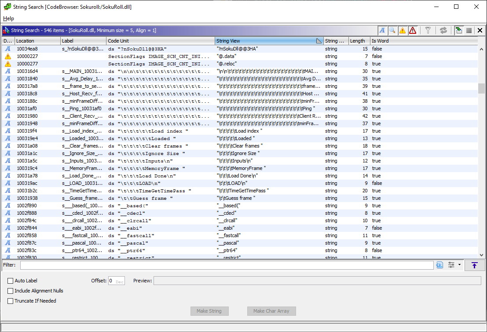

## Search for String
One of the fastest and easiest approach when digging through decompiled code is to look for strings. ``Search > For Strings...`` with the default parameters should be fine.

The strength of this method of approach is that it is really efficient when inspecting code that is very susceptible to have debug functions in it, such as console messages (``std::cout`` and the likes).
 
Though, you will have to ignore the very many system strings present in the results...

However, this method can be unreliable for games as their Release version may not contain any trace of debug logging. Still, a very quick and efficient way to easily guess portions of code.